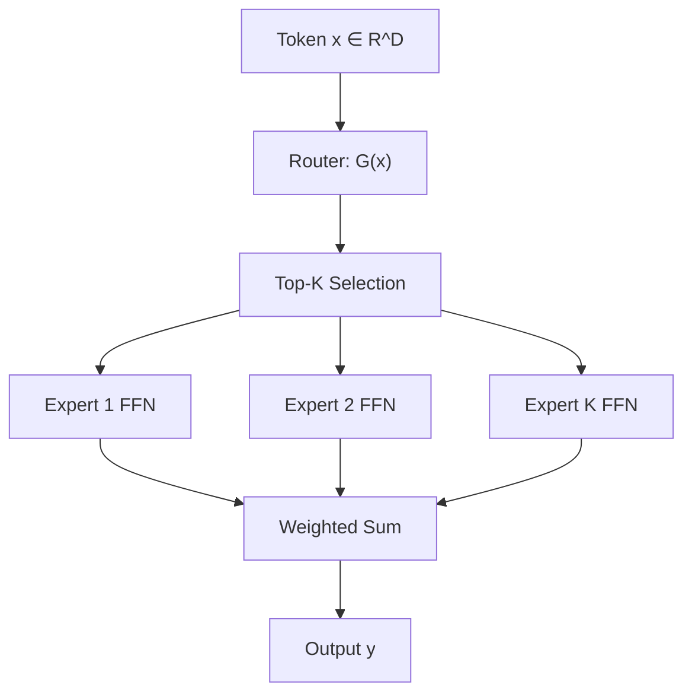

# 第 5 章：混合专家（MoE）

涵盖 `moe.py`、`moe_router.py`、`top_n_gating.py`、`sparse_moe.py`、`expert.py`、`g_shard_moe.py`、`deepseek_moe.py`、`mixtral_expert.py`、`xmoe/` 等。

---

## 1. MoE 基本原理

### 1.1 公式

$$y = \sum_{i=1}^{E} G(x)_i \cdot \text{Expert}_i(x)$$

门控 $G(x) \in \mathbb{R}^E$ 通常稀疏（Top-K）：

$$G(x) = \text{Softmax}(\text{TopK}(W_g x))$$

每个 token 只激活 $K$ 个专家（通常 $K=1$ 或 $2$）。

### 1.2 为什么需要

- **算力扩展**：参数量 $\uparrow$ 而 FLOPs/token $\approx$ 常数
- **专业化**：不同专家学习不同模式（语法、事实、代码等）

### 1.3 挑战

| 问题 | 对策 |
|------|------|
| 负载不均 | Load balancing loss |
| 通信开销 | Expert parallelism, All-to-All |
| 训练不稳定 | Router z-loss, capacity factor |

---

## 2. 公开 API 模块

### 2.1 `MixtureOfExperts`

**文件**：`moe.py`

| 组件 | 作用 |
|------|------|
| `router` | `MoERouter` 实例 |
| `experts` | `nn.ModuleList` of `FeedForward` |
| `forward(x)` | 路由 + 加权专家输出 |

```python
import torch
from zeta.nn import MixtureOfExperts

moe = MixtureOfExperts(dim=512, num_experts=8, ff_mult=4)
x = torch.randn(2, 64, 512)
out = moe(x)
```

### 2.2 `MoERouter`

**文件**：`moe_router.py`

| 参数 | 作用 |
|------|------|
| `mechanism` | `"softmax"` 等路由机制 |
| `hidden_layers` | 门控 MLP 隐层 |

计算 $G(x)$ 并返回 expert 索引与权重。

### 2.3 `TopNGating`

**文件**：`top_n_gating.py`

Top-K 门控实现：

$$G(x)_i = \begin{cases} \frac{\exp(w_i)}{\sum_{j \in \mathcal{T}} \exp(w_j)} & i \in \mathcal{T} \\ 0 & \text{otherwise} \end{cases}$$

$\mathcal{T} = \text{TopK}(Wx)$。

### 2.4 `Top2Gating`

**文件**：`sparse_moe.py`

Top-2 路由（Mixtral 风格），两个专家加权组合。

### 2.5 `NormalSparseMoE` / `HeirarchicalSparseMoE`

**文件**：`sparse_moe.py`

| 类 | 特点 |
|----|------|
| `NormalSparseMoE` | 标准稀疏 MoE 层 |
| `HeirarchicalSparseMoE` | 分层路由：先选专家组，再选专家 |

### 2.6 `VisualExpert`

**文件**：`visual_expert.py`

视觉专用专家 FFN，用于多模态 MoE。

### 2.7 `GatedMoECrossAttn` / `GatedXAttention`

**文件**：`evlm_xattn.py`

门控 MoE 交叉注意力，用于扩展视觉-语言模型。

---

## 3. 内部模块（直接导入）

| 文件 | 类 | 说明 |
|------|-----|------|
| `g_shard_moe.py` | `GShardMoELayer`, `MOELayer`, `Top1Gate`, `Top2Gate` | GShard 风格分布式 MoE |
| `deepseek_moe.py` | `DeepSeekMoE` | DeepSeek 共享专家分离设计 |
| `mixtral_expert.py` | `MixtralExpert` | Mixtral 专家 SWiGLU FFN |
| `expert.py` | `Expert` | 单个专家封装 |
| `poly_expert_fusion_network.py` | `MLPProjectionFusion` | 多专家投影融合 |
| `xmoe/routing.py` | `Top1Gate`, `Top2Gate`, `top1gating`, `top2gating` | 分布式路由原语 |
| `xmoe/global_groups.py` | `get_moe_group`, `get_all2all_group` | 进程组管理 |

---

## 4. 负载均衡辅助损失

Zeta 在 `return_loss_text.py` 中提供 `calc_z_loss` 用于 router 稳定性（关联 Switch Transformer 的 z-loss）：

$$\mathcal{L}_z = \frac{1}{E}\sum_{i=1}^{E} \left(\log \sum_{x} p_i(x)\right)^2$$

鼓励 router  logits 不要过大，避免少数 expert 垄断。

---

## 5. 数据流示意图



---

## 6. 可运行示例

```python
import torch
from zeta.nn import MixtureOfExperts, TopNGating, NormalSparseMoE

x = torch.randn(4, 32, 256)

# 标准 MoE
moe = MixtureOfExperts(dim=256, num_experts=4)
y1 = moe(x)

# 稀疏 MoE
sparse = NormalSparseMoE(dim=256, num_experts=8, top_k=2)
y2 = sparse(x)

print(y1.shape, y2.shape)  # (4, 32, 256)
```

---

## 7. 选型对比

| 方案 | 激活专家数 | 通信 | 代表模型 |
|------|-----------|------|----------|
| Top-1 | 1 | 低 | Switch Transformer |
| Top-2 | 2 | 中 | Mixtral |
| 分层 | 1+1 | 中 | HeirarchicalSparseMoE |
| GShard | 1-2 | **高** | GShard, GLaM |

---

## 8. 参考文献

| 论文 | 链接 |
|------|------|
| Switch Transformers | [2101.03961](https://arxiv.org/abs/2101.03961) |
| GShard | [2006.16668](https://arxiv.org/abs/2006.16668) |
| Mixtral | [Mistral AI Blog](https://mistral.ai/news/mixtral-of-experts/) |
| DeepSeek-MoE | [2401.06066](https://arxiv.org/abs/2401.06066) |
| ST-MoE | [2202.08906](https://arxiv.org/abs/2202.08906) |
| 开源 | [fairseq MoE](https://github.com/facebookresearch/fairseq/tree/main/fairseq/modules/moe) |

---

上一章：[05-ssm-mamba.md](./05-ssm-mamba.md) | 下一章：[07-vision-conv.md](./07-vision-conv.md)
