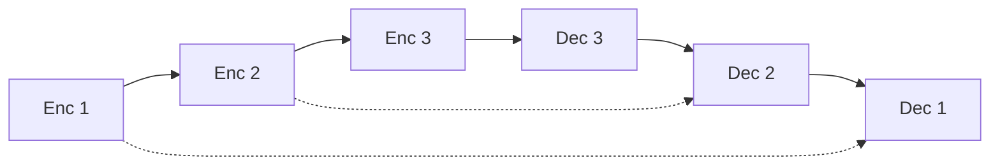

# 第 6 章：视觉与卷积模块

涵盖 CNN、ViT 积木、U-Net、视频模块等 `nn/modules` 中的视觉相关组件。

---

## 1. 视觉 Transformer 积木

### 1.1 Patch 嵌入与头部

| 模块 | 文件 | 符号 | 作用 |
|------|------|------|------|
| Patch 嵌入 | `img_patch_embed.py` | `ImgPatchEmbed` | 图像→patch 序列 |
| Patch 线性展平 | `patch_linear_flatten.py` | `patch_linear_flatten`, `video_patch_linear_flatten`, `cls_tokens`, `vit_output_head` | ViT 展平与分类头 |
| 2D 正弦位置 | `vit_denoiser.py` | `posemb_sincos_2d`, `to_patch_embedding` | 固定 2D 位置编码 |
| ViT Block | `vit_denoiser.py` | `VitTransformerBlock`, `VisionAttention` | 标准 ViT Transformer 块 |
| Token 学习 | `token_learner.py` | `TokenLearner` | 压缩 token 数量 |
| PEG | `peg.py` | 位置编码生成 | 卷积式相对位置 |

### 1.2 `VisionAttention`

多头自注意力 + 可选相对位置，用于 ViT 块内部。

### 1.3 `VitTransformerBlock`

Pre-Norm：`Attention → FFN`，含残差。

```python
import torch
from zeta.nn import VitTransformerBlock

block = VitTransformerBlock(dim=384, heads=6)
x = torch.randn(2, 196, 384)  # 14×14 patches
out = block(x)
```

---

## 2. 卷积网络

### 2.1 经典架构

| 类 | 文件 | 结构要点 |
|----|------|----------|
| `ResNet` | `resnet.py` | 残差块 + 批归一化 |
| `ConvNet` | `convnet.py` | 通用卷积堆叠 |
| `ShuffleNet` | `shufflenet.py` | 通道混洗轻量化 |
| `MBConv` | `mbconv.py` | 倒置瓶颈 + 深度可分离卷积 |
| `MBConvResidual` | `mbconv.py` | 带残差的 MBConv |
| `SqueezeExcitation` | `mbconv.py` | SE 通道注意力 |
| `DropSample` | `mbconv.py` | 随机深度采样 |

**MBConv 公式**（EfficientNet）：

$$\text{MBConv}(x) = x + \text{SE}(\text{PW2}(\text{DW}(\text{PW1}(x))))$$

### 2.2 高效卷积变体

| 类 | 文件 | 特点 |
|----|------|------|
| `FlexiConv` | `flex_conv.py` | 高斯加权深度可分离卷积 |
| `WSConv2d` | `ws_conv2d.py` | Weight Standardization 卷积 |
| `AdaptiveConv3DMod` | `adaptive_conv.py` | 自适应 3D 卷积调制 |
| `Conv2DFeedforward` | `conv_mlp.py` | 2D 卷积 FFN |
| `ConvBNReLU` | `conv_bn_relu.py` | 基础卷积块 |

#### `FlexiConv` 详解

**结构**：
1. 深度卷积 `depthwise`
2. 可学习高斯掩码：$w_{ij} = \exp(-g_{ij}^2)$
3. 掩码加权求和
4. 逐点卷积 `pointwise`

```python
import torch
from zeta.nn import FlexiConv

conv = FlexiConv(3, 64, kernel_size=3, padding=1)
x = torch.randn(1, 3, 224, 224)
out = conv(x)
print(out.shape)  # (1, 64, 224, 224)
```

### 2.3 `NFNStem`

**文件**：`nfn_stem.py`

Neural Field Network 风格 stem，用于特定视觉骨干实验。

---

## 3. U-Net 与分割

### 3.1 `Unet`

**文件**：`unet.py`

经典编码器-解码器 + 跳跃连接：



$$y = \text{Decoder}(\text{Encoder}(x), \text{skip connections})$$

```python
import torch
from zeta.nn import Unet

model = Unet(n_channels=1, n_classes=2)
x = torch.randn(1, 1, 572, 572)
y = model(x)
```

**论文**：[U-Net](https://arxiv.org/abs/1505.04597)

### 3.2 `SuperResolutionNet`

**文件**：`super_resolution.py`

超分辨率重建网络。

### 3.3 `SpatialTransformer`

**文件**：`spatial_transformer.py`

扩散模型中的空间 Transformer 块（Stable Diffusion 风格）。

---

## 4. 视频与时空模块

| 模块 | 文件 | 符号 |
|------|------|------|
| 时空 U-Net | `space_time_unet.py` | `SpaceTimeUnet`, `ResnetBlock`, `Downsample`, `Upsample`, `SpatioTemporalAttention`, `PseudoConv3d`, `FeedForwardV`, `ContinuousPositionBias` |
| 因果 3D 卷积 | `video_autoencoder.py` | `CausalConv3d` |
| 时间下/上采样 | `video_diffusion_modules.py` | `TemporalDownsample`, `TemporalUpsample` |
| 膨胀块 | 同上 | `ConvolutionInflationBlock`, `AttentionBasedInflationBlock` |
| 视频 patch | `patch_video.py` | `patch_video` |
| 视频张量 | `video_to_tensor.py` | `video_to_tensor`, `video_to_tensor_vr` |

**因果 3D 卷积**：时间维仅看过去帧，适合自回归视频生成。

---

## 5. 检测与其他

| 模块 | 文件 | 说明 |
|------|------|------|
| `yolo` | `yolo.py` | YOLO 检测头函数 |
| `DepthWiseConv2d` / `Pool` | `v_pool.py` | 深度卷积池化 |
| `PixelShuffleDownscale` | `pixel_shuffling.py` | 像素重排下采样 |
| `SpatialDownsample` | `spatial_downsample.py` | 空间下采样 |
| `NearestUpsample` | `nearest_upsample.py` | 最近邻上采样 |
| `TimeUpSample2x` | `time_up_sample.py` | 时间维 2× 上采样 |

---

## 6. 归一化（视觉专用）

| 类 | 文件 | 作用 |
|----|------|------|
| `VLayerNorm` | `v_layernorm.py` | 视觉 LayerNorm |
| `ChanLayerNorm` | `chan_layer_norm.py` | 通道维 LayerNorm（Conv 特征图） |

---

## 7. 与 models 层关系

| Model | 使用的视觉积木 |
|-------|----------------|
| `ViT` | `VisionEmbedding`, `VitTransformerBlock` |
| `MaxVit` | MBConv + 块注意力 |
| `NaViT` | 可变分辨率 patch |
| `MegaVit` | 多尺度 ViT |

详见 [10-models.md](./10-models.md)。

---

## 8. 参考文献

| 主题 | 链接 |
|------|------|
| ViT | [2010.11929](https://arxiv.org/abs/2010.11929) |
| U-Net | [1505.04597](https://arxiv.org/abs/1505.04597) |
| EfficientNet/MBConv | [1905.11946](https://arxiv.org/abs/1905.11946) |
| Stable Diffusion | [2112.10752](https://arxiv.org/abs/2112.10752) |
| TokenLearner | [2106.11297](https://arxiv.org/abs/2106.11297) |

---

上一章：[06-moe.md](./06-moe.md) | 下一章：[08-multimodal.md](./08-multimodal.md)
