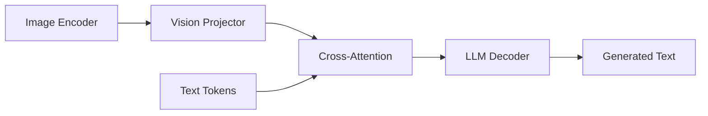

# 第 7 章：多模态模块

涵盖跨模态注意力、融合、投影、条件化等组件。

---

## 1. 多模态架构范式



Zeta 提供 PalmE、GPT4MultiModal 等完整模型，以及下列可组合积木。

---

## 2. 跨模态注意力

| 模块 | 文件 | 符号 | 作用 |
|------|------|------|------|
| 迭代交叉自注意力 | `itca.py` | `IterativeCrossSelfAttention` | 多轮 cross+self 交替 |
| 门控交叉注意力 | `evlm_xattn.py` | `GatedXAttention`, `GatedMoECrossAttn` | 门控 + MoE 交叉注意力 |
| 多模态 KV 注意力 | `multi_layer_key_cache.py` | `MultiLayerKeyValueAttention` | 多层 KV 缓存交叉注意力 |
| Q-Former | `qformer.py` | `QFormer` | 可学习 query 压缩视觉特征 |
| Perceiver | `perceiver_layer.py` | `PerceiverLayer` | 潜变量交叉注意力 |
| Perceiver 重采样 | `perceiver_resampler.py` | `PerceiverResampler`, `GatedCrossAttentionBlock` |

### 2.1 `QFormer`

**原理**：固定 $N_q$ 个可学习 query，通过交叉注意力从视觉特征中提取固定长度表示：

$$Q_{\text{learned}} \xrightarrow{\text{CrossAttn}} \text{Image Features} \rightarrow \text{Compressed Tokens}$$

**论文**：[BLIP-2](https://arxiv.org/abs/2301.12597)

```python
import torch
from zeta.nn import QFormer

qformer = QFormer(dim=768, num_queries=32, heads=8)
vision_feat = torch.randn(2, 256, 768)
queries = qformer(vision_feat)
print(queries.shape)  # (2, 32, 768)
```

### 2.2 `IterativeCrossSelfAttention`

交替执行：
1. Cross-Attn：文本 query 看图像
2. Self-Attn：文本内部交互

适合需要多步融合的 VLM。

---

## 3. 模态融合 FFN

| 模块 | 文件 | 符号 |
|------|------|------|
| 多模态 FFN | `fusion_ffn.py` / `mm_fusion.py` | `MMFusionFFN` |
| 多模态 LayerNorm | `mm_layernorm.py` | `MMLayerNorm` |
| 多模态操作 | `mm_ops.py` | `text_to_twod`, `threed_to_text` |
| 文本-场景融合 | `text_scene_fusion.py` | 场景理解融合 |
| 文本-视频融合 | `text_video_fuse.py` | 视频-文本联合 |
| 全模态融合 | `omnimodal_fusion.py` | 多模态统一融合 |
| 多模态拼接 | `multimodal_concat.py` | 特征拼接 |

### 3.1 `MMFusionFFN`

对多模态 token 应用统一或分路 FFN，可能含模态特定权重。

---

## 4. 模态转换与投影

| 函数/类 | 文件 | 作用 |
|---------|------|------|
| `img_to_text` | `image_to_text.py` | 图像特征→文本空间 reshape |
| `video_to_text` | `video_to_text.py` | 视频→文本序列 |
| `audio_to_text` | `audio_to_text.py` | 音频→文本序列 |
| `image_or_video_to_time` | `img_or_video_to_time.py` | 时空展平 |
| `GILLMapper` | `gill_mapper.py` | GILL 映射器 |
| `CrossModalReParametrization` | `cross_modal_reparametization.py` | 跨模态重参数化 |
| `CrossModalReparamLinear` | 同上 | 重参数化线性层 |
| `cross_modal_ffn` | 同上 | 跨模态 FFN |
| `build_cross_modal_reparam_linear` | 同上 | 构建辅助函数 |
| `change_original_linear_to_reparam` | 同上 | 替换现有线性层 |
| `reparameterize_aux_into_target_model` | 同上 | 合并辅助权重 |

**重参数化思想**：训练时用多分支（模态特定），推理时合并为单分支加速。

---

## 5. 条件化模块

### 5.1 FiLM（Feature-wise Linear Modulation）

**文件**：`film.py`, `film_conditioning.py`

$$\text{FiLM}(h | c) = \gamma(c) \odot h + \beta(c)$$

条件 $c$ 生成缩放 $\gamma$ 与偏移 $\beta$，调制特征 $h$。

**论文**：[FiLM](https://arxiv.org/abs/1709.07871)

```python
import torch
from zeta.nn import Film

film = Film(dim=128, hidden_dim=64)
conditions = torch.randn(10, 128)
hiddens = torch.randn(10, 1, 128)
out = film(conditions, hiddens)
```

### 5.2 适配器

| 类 | 文件 | 用途 |
|----|------|------|
| `Lora` | `lora.py` | 低秩适配 $W + BA$ |
| `MRAdapter` | `mr_adapter.py` | 多分辨率适配器 |
| `CROMEAdapter` | `crome_adapter.py` | CROME 跨模态适配 |
| `CogVLMTwoAdapter` | `cog_vlm_two_adapter.py` | CogVLM 两阶段适配 |
| `mm_adapter.py` | `MMAdapter` | 通用多模态适配 |

**LoRA 公式**：

$$h = W_0 x + \frac{\alpha}{r} B A x, \quad A \in \mathbb{R}^{r \times d}, B \in \mathbb{R}^{d' \times r}$$

---

## 6. 多输入多输出

**文件**：`multi_input_multi_output.py`

| 类 | 作用 |
|----|------|
| `MultiModalEmbedding` | 多模态嵌入表 |
| `MultiInputMultiModalConcatenation` | 多路输入拼接 |
| `DynamicInputChannels` | 动态输入通道 |
| `DynamicOutputDecoder` | 动态输出解码 |
| `OutputHead` / `OutputDecoders` | 多头输出 |
| `SplitMultiOutput` | 输出拆分 |

---

## 7. 损失函数

| 类 | 文件 | 公式要点 |
|----|------|----------|
| `SigLipLoss` | `sig_lip.py` | Sigmoid 对比损失（无全局 softmax） |
| `SigLipSigmoidLoss` | `sig_lip_loss.py` | 变体 |

**SigLIP**：

$$\mathcal{L} = -\sum_{(i,j) \in \mathcal{P}} \log \sigma(s \cdot x_i^\top y_j) - \sum_{(i,j) \in \mathcal{N}} \log \sigma(-s \cdot x_i^\top y_j)$$

**论文**：[Sigmoid Loss for Language Image Pre-Training](https://arxiv.org/abs/2303.15343)

---

## 8. 完整多模态模型示例（PalmE 风格）

```python
import torch
from zeta.structs import (
    AutoRegressiveWrapper, Decoder, Encoder,
    Transformer, ViTransformerWrapper,
)

class PalmE(torch.nn.Module):
    def __init__(self):
        super().__init__()
        self.encoder = ViTransformerWrapper(
            image_size=256, patch_size=32,
            attn_layers=Encoder(dim=512, depth=6, heads=8),
        )
        self.decoder = AutoRegressiveWrapper(Transformer(
            num_tokens=20000, max_seq_len=1024,
            attn_layers=Decoder(
                dim=512, depth=6, heads=8,
                cross_attend=True, rotary_xpos=True,
            ),
        ))

    def forward(self, img, text):
        encoded = self.encoder(img, return_embeddings=True)
        return self.decoder(text, context=encoded)

img = torch.randn(1, 3, 256, 256)
text = torch.randint(0, 20000, (1, 64))
model = PalmE()
out = model(img, text)
```

---

## 9. 参考文献

| 主题 | 链接 |
|------|------|
| PalmE | [2303.07854](https://arxiv.org/abs/2303.07854) |
| BLIP-2 / Q-Former | [2301.12597](https://arxiv.org/abs/2301.12597) |
| FiLM | [1709.07871](https://arxiv.org/abs/1709.07871) |
| LoRA | [2106.09685](https://arxiv.org/abs/2106.09685) |
| SigLIP | [2303.15343](https://arxiv.org/abs/2303.15343) |
| Perceiver | [2103.03206](https://arxiv.org/abs/2103.03206) |

---

上一章：[07-vision-conv.md](./07-vision-conv.md) | 下一章：[09-quantization.md](./09-quantization.md)
