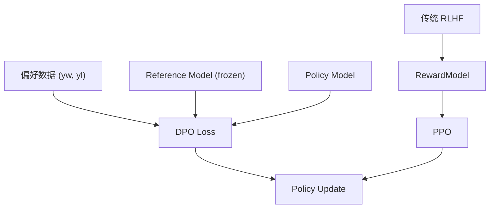

# 第 12 章：强化学习（zeta.rl）

## 1. 模块清单

| 文件 | 公开符号 | 状态 |
|------|----------|------|
| `dpo.py` | `DPO`, `log_prob`, `log_prob_from_model_and_seq`, `freeze_all_layers` | ✓ 公开 |
| `actor_critic.py` | `ActorCritic`, `ppo` | ✓ 公开 |
| `hindsight_replay.py` | `HindsightExperienceReplay` | ✓ 公开 |
| `language_reward.py` | `LanguageReward` | ✓ 公开 |
| `ppo.py` | `ActorCritic`, `ppo_step` | 内部（重复实现） |
| `reward_model.py` | `RewardModel` | 内部 |
| `vision_model_rl.py` | `VisionRewardModel`, `ResidualBlock` | 内部 |
| `priortized_replay_buffer.py` | `PrioritizedReplayBuffer` | 内部 |
| `priortized_rps.py` | `PrioritizedSequenceReplayBuffer` | 内部 |
| `sumtree.py` | `SumTree` | 内部 |
| `rest.py` | — | 占位符 |

---

## 2. DPO（Direct Preference Optimization）

### 2.1 原理

从 RLHF 推导，无需显式奖励模型，直接优化偏好数据。

**目标**：

$$\mathcal{L}_{\text{DPO}} = -\mathbb{E}_{(x, y_w, y_l)}\left[\log \sigma\left(\beta \log\frac{\pi_\theta(y_w|x)}{\pi_{\text{ref}}(y_w|x)} - \beta \log\frac{\pi_\theta(y_l|x)}{\pi_{\text{ref}}(y_l|x)}\right)\right]$$

其中 $y_w$ 为 preferred，$y_l$ 为 unpreferred，$\beta$ 控制偏离参考模型的程度。

**推导要点**：在 Bradley-Terry 偏好模型下，最优策略有闭式，消去显式奖励 $r(x,y)$。

### 2.2 `DPO` 类

**文件**：`dpo.py`

| 方法/属性 | 作用 |
|-----------|------|
| `__init__(model, beta=0.1)` | 创建 policy + 冻结的 ref_model（deepcopy） |
| `parameters()` | 返回 policy 可训练参数 |
| `forward(preferred_seq, unpreferred_seq)` | 计算 DPO loss |

| 辅助函数 | 作用 |
|----------|------|
| `log(t, eps)` | 数值稳定 log |
| `log_prob(prob, indices)` | 从概率分布取 log prob |
| `log_prob_from_model_and_seq(model, seq)` | 模型对序列的 log prob |
| `freeze_all_layers(module)` | 冻结参数（**注意**：源码拼写 `reqires_grad` 为 bug） |

```python
import torch
from torch import nn
from zeta.rl import DPO

class Policy(nn.Module):
    def __init__(self, dim, vocab):
        super().__init__()
        self.fc = nn.Linear(dim, vocab)
    def forward(self, x):
        return self.fc(x)

policy = Policy(10, 5)
dpo = DPO(model=policy, beta=0.1)

preferred = torch.randint(0, 5, (3, 10))
unpreferred = torch.randint(0, 5, (3, 10))
loss = dpo(preferred, unpreferred)
loss.backward()
```

**论文**：[Direct Preference Optimization](https://arxiv.org/abs/2305.18290)  
**开源**：[eric-mitchell/direct-preference-optimization](https://github.com/eric-mitchell/direct-preference-optimization)

---

## 3. PPO（Proximal Policy Optimization）

### 3.1 原理

裁剪 surrogate 目标：

$$L^{\text{CLIP}} = \mathbb{E}\left[\min\left(r_t(\theta)\hat{A}_t, \text{clip}(r_t(\theta), 1-\epsilon, 1+\epsilon)\hat{A}_t\right)\right]$$

$$r_t(\theta) = \frac{\pi_\theta(a_t|s_t)}{\pi_{\theta_{\text{old}}}(a_t|s_t)}$$

### 3.2 `ActorCritic`

| 组件 | 作用 |
|------|------|
| `actor` | 策略网络 → `Categorical` 分布 |
| `critic` | 价值网络 → 标量 $V(s)$ |
| `forward(x)` | 返回 `(dist, value)` |

### 3.3 `ppo` 函数

| 参数 | 作用 |
|------|------|
| `policy_net`, `value_net` | 策略与价值网络 |
| `optimizer_policy`, `optimizer_value` | 优化器 |
| `states`, `actions`, `returns`, `advantages` | 轨迹数据 |
| `clip_param` | 裁剪阈值（默认 0.2） |

执行一步 PPO 更新（策略损失 + 价值损失 + 熵 bonus）。

```python
import torch
from zeta.rl import ActorCritic, ppo

ac = ActorCritic(num_inputs=4, num_outputs=2, hidden_size=64)
state = torch.randn(8, 4)
dist, value = ac(state)
action = dist.sample()
```

**论文**：[Proximal Policy Optimization](https://arxiv.org/abs/1707.06347)  
**开源**：[openai/baselines](https://github.com/openai/baselines)

---

## 4. 奖励与经验回放

### 4.1 `LanguageReward`

**文件**：`language_reward.py`

基于语言模型打分作为奖励信号（RLHF 流水线组件）。

### 4.2 `RewardModel`

**文件**：`reward_model.py`

| 组件 | 作用 |
|------|------|
| 偏好对编码 | chosen vs rejected |
| `forward` | 标量奖励 $r(x, y)$ |

Bradley-Terry 损失：

$$\mathcal{L} = -\log \sigma(r(x, y_w) - r(x, y_l))$$

### 4.3 `VisionRewardModel`

视觉任务奖励模型，含 `ResidualBlock` 视觉骨干。

### 4.4 `HindsightExperienceReplay`（HER）

**原理**：将失败轨迹的目标替换为 **实际达到** 的状态，生成虚拟成功样本：

$$s'_{\text{goal}} = s_{\text{achieved}}$$

**论文**：[Hindsight Experience Replay](https://arxiv.org/abs/1707.01495)

### 4.5 优先经验回放

| 类 | 文件 | 作用 |
|----|------|------|
| `PrioritizedReplayBuffer` | `priortized_replay_buffer.py` | TD-error 优先级采样 |
| `PrioritizedSequenceReplayBuffer` | `priortized_rps.py` | 序列级优先回放 |
| `SumTree` | `sumtree.py` | $O(\log n)$ 优先级树 |

采样概率：

$$P(i) = \frac{p_i^\alpha}{\sum_k p_k^\alpha}$$

---

## 5. RL 流水线示意



---

## 6. 选型

| 方法 | 需要奖励模型 | 数据 | 稳定性 | 场景 |
|------|-------------|------|--------|------|
| DPO | **否** | 偏好对 | 高 | LLM 对齐首选 |
| PPO+RM | 是 | 在线 rollout | 中 | 经典 RLHF |
| HER | 否 | 目标条件 RL | 高 | 机器人/导航 |

---

上一章：[12-optim.md](./12-optim.md) | 下一章：[14-training.md](./14-training.md)
