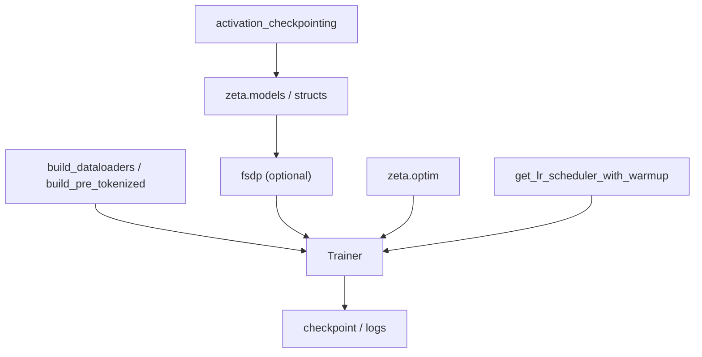

# 第 13 章：训练基础设施（zeta.training）

## 1. 模块清单

| 文件 | 公开符号 | 作用 |
|------|----------|------|
| `train.py` | `Trainer`, `train` | 高层训练循环 |
| `dataloader.py` | `build_dataloaders`, `build_pre_tokenized` | 数据加载 |
| `fsdp.py` | `fsdp` | FSDP 分布式包装 |
| `scheduler.py` | `get_lr_scheduler_with_warmup` | LR 调度 |
| `parallel_wrapper.py` | `ParallelWrapper` | 模型并行包装 |
| `activation_checkpoint.py` | `activation_checkpointing` | 梯度检查点 |
| `galore.py` | `GaloreOptimizer` | GaLore 低秩梯度 |
| `hive_trainer.py` | `HiveTrainer` | 多实验 Hive 训练 |

---

## 2. `Trainer` / `train`

### 2.1 职责

- 标准训练循环：forward → loss → backward → step
- 日志、checkpoint、验证钩子
- 与 `optim`、`utils` 集成

### 2.2 典型用法

```python
from zeta.training import Trainer, train

# trainer = Trainer(
#     model=model,
#     train_dataloader=train_dl,
#     optimizer=optimizer,
#     lr_scheduler=scheduler,
# )
# train(trainer, epochs=10)
```

---

## 3. 数据加载

### 3.1 `build_dataloaders`

构建 train/val DataLoader，支持 batch size、workers、pin_memory 等。

### 3.2 `build_pre_tokenized`

加载 **预 tokenize** 数据（磁盘上的 token id），跳过后台 tokenization，加速大模型训练。

---

## 4. FSDP 分布式

### 4.1 `fsdp` 函数

**文件**：`fsdp.py`

封装 PyTorch Fully Sharded Data Parallel：

- 参数分片到多 GPU
- 降低单卡显存峰值
- 与 `accelerate` 生态兼容

**适用**：单模型放不进单卡时的多卡训练。

**参考**：[PyTorch FSDP](https://pytorch.org/tutorials/intermediate/FSDP_tutorial.html)

```python
from zeta.training import fsdp

# sharded_model = fsdp(model, ...)
```

---

## 5. 学习率调度

### 5.1 `get_lr_scheduler_with_warmup`

线性 warmup + 余弦/线性衰减：

$$\eta_t = \begin{cases}
\eta_{\max} \cdot t / T_{\text{warmup}} & t < T_{\text{warmup}} \\
\eta_{\min} + \frac{1}{2}(\eta_{\max}-\eta_{\min})(1+\cos(\pi \cdot \frac{t-T_w}{T-T_w})) & \text{cosine}
\end{cases}$$

---

## 6. 其他训练工具

### 6.1 `ParallelWrapper`

模型并行或数据并行统一包装，与 `nn.modules.parallel_wrapper.Parallel` 配合。

### 6.2 `activation_checkpointing`

梯度检查点：前向不保存中间激活，反向重算，**换显存为算力**：

$$\text{Memory} \downarrow \approx 50\text{-}80\%, \quad \text{Compute} \uparrow \approx 30\text{-}40\%$$

### 6.3 `GaloreOptimizer`

**GaLore**：梯度低秩投影，全参数训练但优化状态压缩。

**论文**：[GaLore: Memory-Efficient LLM Training by Gradient Low-Rank Projection](https://arxiv.org/abs/2403.03507)

### 6.4 `HiveTrainer`

多 run / 多配置并行实验管理（Hive 式训练编排）。

---

## 7. 训练流水线架构



---

## 8. 与 `nn.modules` 训练工具的关系

| 模块 | 位置 | 作用 |
|------|------|------|
| `return_loss_text` | `nn/modules` | 交叉熵 + z-loss |
| `transformer_generate` | `nn/modules` | 生成 |
| `freeze_all_layers` | `nn/modules` | 冻结层 |
| `hyper_optimize` | `nn/modules/pyro.py` | 编译/量化 |

---

上一章：[13-rl.md](./13-rl.md) | 下一章：[15-utils.md](./15-utils.md)
