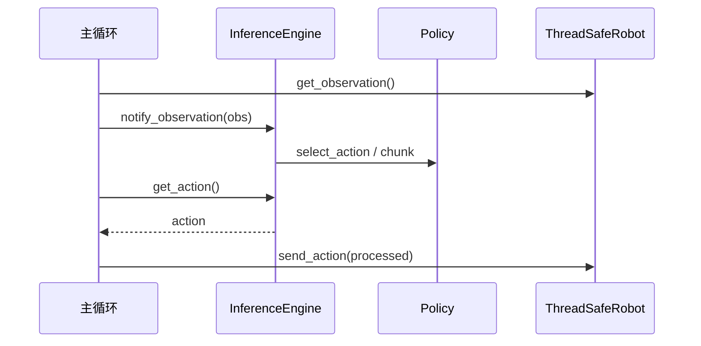

# 09 — 部署推理（Rollout & Async Inference）

## 1. 模块边界

```
rollout/
├── configs.py              # RolloutConfig, RolloutStrategyConfig
├── context.py              # build_rollout_context, RolloutContext
├── robot_wrapper.py        # ThreadSafeRobot
├── ring_buffer.py          # RolloutRingBuffer
├── inference/
│   ├── base.py             # InferenceEngine ABC
│   ├── sync.py             # SyncInferenceEngine
│   ├── rtc.py              # RTCInferenceEngine
│   └── factory.py          # create_inference_engine
└── strategies/
    ├── base.py             # BaseStrategy
    ├── sentry.py           # 持续录制
    ├── highlight.py        # 环形缓冲高光
    ├── dagger.py           # 人类干预
    └── episodic.py         # 分 episode 录制

async_inference/
├── policy_server.py        # GPU 端 gRPC 服务
├── robot_client.py         # 机器人端客户端
├── configs.py
└── helpers.py

transport/                    # gRPC protobuf
```

**入口 CLI**：`lerobot-rollout`

---

## 2. 为什么需要 Rollout 模块？

| lerobot-eval | lerobot-rollout |
|--------------|-----------------|
| Gymnasium 仿真 | 真机 `Robot` |
| 批量 vector env | 单机器人控制循环 |
| 指标：success rate | 策略：录制/DAgger/Hub 推送 |

Rollout 统一：**策略加载 + processor + 推理引擎 + 可选 dataset 写入 + 安全发送**。

---

## 3. RolloutConfig

关键字段：

| 字段 | 说明 |
|------|------|
| `robot` | `RobotConfig` |
| `policy.path` | Hub/本地 checkpoint |
| `strategy` | `RolloutStrategyConfig` 子类 |
| `inference` | `sync` 或 `rtc` |
| `dataset` | 可选录制配置 |
| `fps` | 控制频率 |

---

## 4. RolloutContext

**文件**：`context.py`

`build_rollout_context(cfg)` 组装：

| 成员 | 来源 |
|------|------|
| `robot` | `ThreadSafeRobot(make_robot(...))` |
| `policy` | `make_policy` |
| `preprocessor` / `postprocessor` | checkpoint |
| `inference_engine` | `create_inference_engine` |
| `dataset` | 可选 `LeRobotDataset.resume` |
| `robot_action_processor` | 最终 send 前处理 |

---

## 5. InferenceEngine

### 5.1 抽象 API（`inference/base.py`）

| 方法 | 作用 |
|------|------|
| `start()` / `stop()` / `reset()` | 生命周期 |
| `get_action(obs_frame)` | 主循环取下一动作 |
| `notify_observation(obs)` | 异步引擎更新 obs |
| `pause()` / `resume()` | 暂停后台推理 |
| `ready` / `failed` | warmup 状态 |

### 5.2 SyncInferenceEngine

**每控制 tick**：

```
obs → preprocessor → policy.select_action() → postprocessor → action tensor
```

- 简单、延迟可预测
- **不支持**启用 `RelativeActionsProcessorStep` 的策略（会显式报错）

### 5.3 RTCInferenceEngine

**Real-Time Chunking** — 适用于慢 VLA：

```
后台线程: predict_action_chunk() + RTC prefix re-anchor → ActionQueue
主线程:   pop action → postprocessor → robot
```

特性：

- `torch.compile` 可选 warmup
- `LatencyTracker` 自适应
- relative action 与 state re-anchor
- 需 `ThreadSafeRobot` 保护并发读写

**何时选 RTC？**

- 推理时间 > 控制周期（如 PI0 100ms+ infer @ 30Hz control）
- 使用 relative action 空间的 VLA

---

## 6. Rollout 策略（Strategy）

| type | 类 | 行为 |
|------|-----|------|
| `base` | `BaseStrategy` | 纯自主执行，不录数据 |
| `sentry` | `SentryStrategy` | 持续 autonomous + 始终录制；按 chunk 对齐 rotate episode； periodic Hub push |
| `highlight` | `HighlightStrategy` | `RolloutRingBuffer` 保留最近 N 秒；按键保存片段 |
| `dagger` | `DAggerStrategy` | 状态机：AUTONOMOUS ↔ PAUSED ↔ CORRECTING；键盘/踏板切换 teleop |
| `episodic` | `EpisodicStrategy` | 类似 record 的多 episode；每 episode `policy.reset()` |

共享逻辑（`strategies/core.py`）：

- `_init_engine()` — warmup 直到 `engine.ready`
- `send_next_action()` — `ActionInterpolator` + `robot_action_processor` + `send_action`
- `_teardown_hardware()` — disconnect

---

## 7. RolloutRingBuffer

固定容量环形缓冲：

- 限制：`max_seconds × fps` 帧数 & `max_memory_mb`
- `append(frame)` / `drain()` → list 并清空
- 单线程（主 rollout loop）

---

## 8. ThreadSafeRobot

包装 `Robot`：

- `Lock` 保护 `get_observation()` / `send_action()`
- 属性代理：`observation_features`, `action_features`, `inner`

RTC 后台线程与主循环**必须**使用此包装。

---

## 9. Async Inference（gRPC）

**场景**：GPU 服务器运行大 VLA；机器人笔记本只跑轻量 client。

### 9.1 组件

| 组件 | 文件 | 角色 |
|------|------|------|
| PolicyServer | `policy_server.py` | 加载 policy+processor；接收 obs protobuf；返回 action |
| RobotClient | `robot_client.py` | 采集 obs → gRPC → 执行 action |
| transport | `transport/services.proto` | gRPC 服务定义 |

### 9.2 配置

- `PolicyServerConfig` — host/port、policy.path
- `RobotClientConfig` — server 地址、robot 配置

### 9.3 extra

```bash
uv sync --extra async
```

依赖 `grpcio`, `protobuf`。

---

## 10. 部署流程图



---

## 11. 示例

### 11.1 基础 rollout（sync）

```bash
uv sync --locked --extra core_scripts --extra feetech --extra pi

lerobot-rollout \
  --robot.type=so101_follower \
  --robot.port=/dev/ttyACM0 \
  --policy.path=lerobot/smolvla_so101_finetuned \
  --strategy.type=base \
  --inference.type=sync \
  --fps=30
```

### 11.2 PI0 + RTC + 录制

```bash
lerobot-rollout \
  --robot.type=so101_follower \
  --policy.path=lerobot/pi0_so101 \
  --inference.type=rtc \
  --strategy.type=sentry \
  --dataset.repo_id=user/pi0_rollouts \
  --dataset.single_task="pick and place"
```

### 11.3 DAgger 干预

```bash
lerobot-rollout \
  --robot.type=so101_follower \
  --teleop.type=so101_leader \
  --policy.path=lerobot/act_my_task \
  --strategy.type=dagger \
  --inference.type=sync
```

---

## 12. 常见问题

| 现象 | 原因 | 处理 |
|------|------|------|
| 动作幅度异常 | 未加载 postprocessor | 检查 `--policy.path` 含 processor |
| Sync 报错 relative action | VLA 需 RTC | `--inference.type=rtc` |
| 控制卡顿 | infer 慢于 fps | RTC 或 async server |
| chunk 边界抖动 | 无 RTC re-anchor | 启用 rtc + 调 `RTCProcessor` 参数 |

---

## 下一章

- 全部 CLI → [10-cli-reference.md](./10-cli-reference.md)
