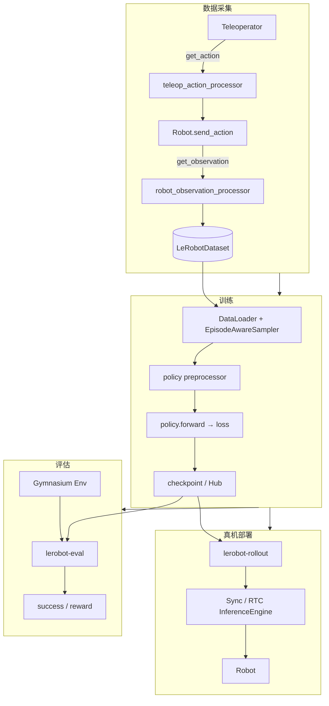

# LeRobot 技术文档索引

> 版本：基于 LeRobot **0.5.2**（`src/lerobot/`）  
> 本文档面向开发者与研究者，从总体架构到各模块 API 做系统解读。  
> 官方用户教程见 [Hugging Face 文档](https://huggingface.co/docs/lerobot/index)；`docs/source/` 为 HF 文档源文件。

---

## 文档地图

| 章节 | 文件 | 主题 |
|------|------|------|
| **总览** | [01-architecture-overview.md](./01-architecture-overview.md) | 整体架构、数据流、模块关系、设计权衡 |
| **核心抽象** | [02-core-types-and-config.md](./02-core-types-and-config.md) | `EnvTransition`、类型系统、Draccus 配置、ChoiceRegistry |
| **数据集** | [03-dataset-system.md](./03-dataset-system.md) | LeRobotDataset v3、读写、视频编解码、工具链 |
| **处理器** | [04-processor-pipeline.md](./04-processor-pipeline.md) | ProcessorStep 管道、30 种注册步骤、Hub 序列化 |
| **策略模型** | [05-policies.md](./05-policies.md) | 16 种策略、PreTrainedPolicy、工厂与 PEFT |
| **训练与评估** | [06-training-evaluation.md](./06-training-evaluation.md) | `lerobot-train` / `lerobot-eval`、优化器、Accelerate |
| **硬件层** | [07-hardware-layer.md](./07-hardware-layer.md) | Robot、Teleoperator、Camera、Motors |
| **仿真环境** | [08-environments.md](./08-environments.md) | EnvConfig、12 种环境、EnvHub |
| **部署推理** | [09-rollout-inference.md](./09-rollout-inference.md) | Rollout、RTC、异步 gRPC 推理 |
| **CLI 参考** | [10-cli-reference.md](./10-cli-reference.md) | 全部 18 个命令行入口 |
| **扩展模块** | [11-advanced-modules.md](./11-advanced-modules.md) | 奖励模型、RL、标注、工具函数 |

---

## 快速导航：按任务查找

| 我想… | 阅读章节 |
|--------|----------|
| 理解项目整体设计 | [01 架构总览](./01-architecture-overview.md) |
| 采集遥操作数据 | [07 硬件层](./07-hardware-layer.md) + [03 数据集](./03-dataset-system.md) + [10 CLI `lerobot-record`](./10-cli-reference.md) |
| 训练模仿学习策略 | [06 训练](./06-training-evaluation.md) + [05 策略](./05-policies.md) |
| 在仿真中评估 | [08 环境](./08-environments.md) + [06 评估](./06-training-evaluation.md) |
| 真机部署策略 | [09 部署推理](./09-rollout-inference.md) |
| 自定义机器人/策略 | [02 配置](./02-core-types-and-config.md) + [04 处理器](./04-processor-pipeline.md) |
| 扩展第三方插件 | [02 配置 §插件](./02-core-types-and-config.md) |

---

## 源码目录速查

```
src/lerobot/
├── configs/          # 训练/评估/数据集/策略配置（Draccus）
├── datasets/         # LeRobotDataset v3
├── processor/        # 数据变换管道
├── policies/         # 16 种策略实现
├── robots/           # 17 种机器人
├── teleoperators/    # 19 种遥操作设备
├── cameras/          # 4 种相机后端
├── motors/           # 4 种电机总线驱动
├── envs/             # 12 种仿真/真机环境
├── rollout/          # 真机策略部署
├── async_inference/  # 远程 gRPC 推理
├── rewards/          # 4 种奖励模型
├── rl/               # 在线 RL（SAC）
├── scripts/          # CLI 入口
├── optim/            # 优化器与学习率调度
├── utils/            # 通用工具
└── types.py          # EnvTransition 等核心类型
```

---

## 端到端数据流（一图速览）



---

## 与现有文档的关系

| 路径 | 用途 |
|------|------|
| `docs/source/*.mdx` | Hugging Face 官方文档（安装、硬件教程、各策略 README） |
| `docs/technical/` | **本技术文档**——架构解读、模块边界、API 与调用关系 |
| `AGENT_GUIDE.md` | 面向 SO-101 用户的可复制命令 |
| `examples/` | 按场景组织的示例脚本 |

建议阅读顺序：**01 → 02 → 03/04 → 05 → 06**，再按需查阅硬件/环境/部署章节。
