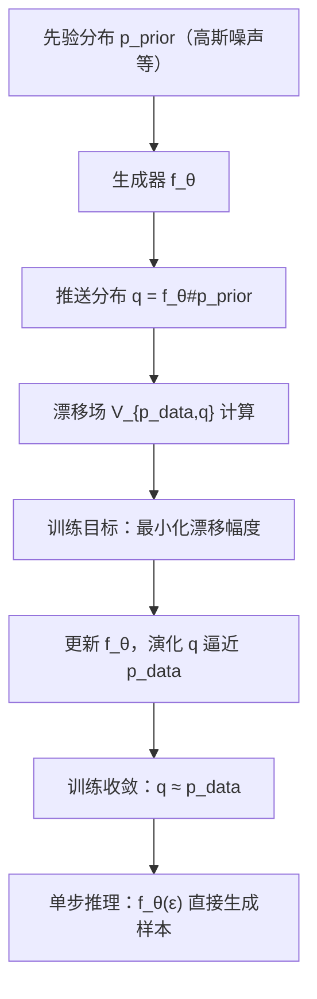

## Drifting Models 算法原理详细解析（含完整公式）
Drifting Models 是一种面向生成式建模的全新范式，核心创新在于将“分布推送”过程从推理阶段转移到训练阶段，通过引入**漂移场（Drifting Field）**  govern 样本分布的演化，最终实现**单步推理（1-NFE）** 下的高质量生成。该算法突破了扩散模型、流匹配等传统方法依赖多步迭代的效率瓶颈，在 ImageNet 256×256 生成任务中达到当前单步方法的最优性能（ latent 空间 FID 1.54，像素空间 FID 1.61），同时可扩展至机器人控制等其他领域。以下从核心思想、算法架构、关键模块、完整公式及实验验证等方面逐层解析。

### 一、算法核心思想
生成式建模的本质是学习一个映射 \(f\)，使得先验分布 \(p_{prior}\) 的**推送分布（Pushforward Distribution）** \(f_{\#}p_{prior}\) 逼近数据分布 \(p_{data}\)。传统方法（如扩散、流匹配）通过**推理阶段的多步迭代**实现分布转换，而 Drifting Models 的核心思想是：
1. **训练时分布演化**：将多步迭代过程嵌入训练阶段，通过优化让模型序列 \(\{f_i\}\) 对应的推送分布 \(q_i = [f_i]_{\#}p_{prior}\) 逐步逼近 \(p_{data}\)；
2. **漂移场引导**：引入漂移场 \(V_{p,q}\) 描述样本的“漂移方向”，该场由数据分布 \(p\) 和当前生成分布 \(q\) 共同决定，且满足 **平衡条件**——当 \(q=p\) 时，\(V_{p,q}=0\)，样本停止漂移；
3. **单步推理**：训练完成后，单个模型 \(f\) 即可直接将先验分布映射到数据分布，无需推理时的迭代更新，大幅提升生成效率。

### 二、算法整体架构
Drifting Models 的架构围绕“训练时分布演化”展开，分为三大核心模块：**推送分布定义**、**漂移场设计**、**训练目标与优化**，并可扩展至特征空间漂移、分类器无引导（CFG）等增强模块，整体流程如下图所示：

### 三、关键模块与完整公式
#### （一）基础定义：推送分布（Pushforward Distribution）
##### 1. 核心概念
设生成器 \(f: \mathbb{R}^C \mapsto \mathbb{R}^D\)，输入为来自先验分布的随机变量 \(\epsilon \sim p_{\epsilon}\)（如高斯噪声），输出为生成样本 \(x = f(\epsilon)\)。生成样本的分布 \(q\) 称为 \(p_{\epsilon}\) 在 \(f\) 下的推送分布，记为：
\[
q = f_{\#}p_{\epsilon} \tag{1}
\]
- 符号说明：\(f_{\#}\) 表示“推送操作”，即 \(f\) 对分布的转换作用；\(C\) 为输入维度，\(D\) 为输出维度（可不等）。

##### 2. 训练时的分布演化
由于神经网络训练是迭代优化过程（如 SGD），训练过程会产生模型序列 \(\{f_i\}\)，对应推送分布序列 \(\{q_i = [f_i]_{\#}p_{\epsilon}\}\)。当模型参数更新时，样本的“漂移量”为：
\[
\Delta x_i = f_{i+1}(\epsilon) - f_i(\epsilon) \tag{2}
\]
即样本 \(x_i = f_i(\epsilon)\) 会漂移至 \(x_{i+1} = x_i + \Delta x_i\)，推送分布也随之从 \(q_i\) 演化至 \(q_{i+1}\)。

#### （二）核心模块1：漂移场（Drifting Field）设计
漂移场是 Drifting Models 的核心，其作用是为每个样本提供明确的漂移方向，确保推送分布逐步逼近数据分布。

##### 1. 漂移场的数学定义
漂移场 \(V_{p,q}: \mathbb{R}^d \to \mathbb{R}^d\) 是一个向量场，输入为样本 \(x\)，输出为该样本的漂移方向，满足以下核心性质：
- **反称性（Anti-symmetry）**：
  \[
  V_{p,q}(x) = -V_{q,p}(x), \quad \forall x \tag{3}
  \]
- **平衡条件**：若 \(q = p\)，则 \(V_{p,q}(x) = 0\)（证明：\(q=p \implies V_{p,q}=V_{q,p}=-V_{p,q} \implies V_{p,q}=0\)）。

##### 2. 可计算的漂移场实例（吸引-排斥机制）
为实现可计算性，论文基于**均值漂移（Mean Shift）** 设计了由“数据吸引”和“生成分布排斥”构成的漂移场：
- 数据吸引场 \(V_p^+(x)\)：由数据分布 \(p\) 对样本 \(x\) 的吸引力决定：
  \[
  V_p^+(x) = \frac{1}{Z_p(x)} \mathbb{E}_{y^+ \sim p} \left[ k(x, y^+) (y^+ - x) \right] \tag{4}
  \]
- 生成排斥场 \(V_q^-(x)\)：由当前生成分布 \(q\) 对样本 \(x\) 的排斥力决定：
  \[
  V_q^-(x) = \frac{1}{Z_q(x)} \mathbb{E}_{y^- \sim q} \left[ k(x, y^-) (y^- - x) \right] \tag{5}
  \]
- 归一化因子：\(Z_p(x) = \mathbb{E}_{y^+ \sim p} [k(x, y^+)]\)，\(Z_q(x) = \mathbb{E}_{y^- \sim q} [k(x, y^-)]\)，确保场的幅度可解释（6）；
- 最终漂移场：吸引场与排斥场的差值，天然满足反称性（3）：
  \[
  V_{p,q}(x) = V_p^+(x) - V_q^-(x) \tag{6}
  \]

##### 3. 核函数选择
核函数 \(k(x,y)\) 用于衡量样本间相似度，论文采用高斯核的变体（基于 \(\ell_2\) 距离）：
\[
k(x, y) = \exp\left( -\frac{1}{\tau} \|x - y\| \right) \tag{7}
\]
- 符号说明：\(\tau\) 为温度参数，控制相似度的衰减速率；\(\|x-y\|\) 为样本 \(x\) 与 \(y\) 的 \(\ell_2\) 距离。

##### 4. 漂移场的简化计算（批量估计）
在随机训练（Mini-batch）中，通过批量样本逼近期望，将式（6）简化为：
\[
V_{p,q}(x) = \frac{1}{Z_p Z_q} \mathbb{E}_{y^+ \sim p, y^- \sim q} \left[ k(x, y^+) k(x, y^-) (y^+ - y^-) \right] \tag{8}
\]
- 实际实现中，通过 Softmax 对核函数进行归一化（类似 InfoNCE），同时在 \(x\) 和 \(y\) 两个维度上归一化，提升稳定性（见附录算法 2）。

#### （三）核心模块2：训练目标与优化
##### 1. 平衡条件导出的训练目标
当模型达到最优状态 \(\hat{\theta}\) 时，推送分布 \(q_{\hat{\theta}} = p_{data}\)，漂移场为 0，满足固定点方程：
\[
f_{\hat{\theta}}(\epsilon) = f_{\hat{\theta}}(\epsilon) + V_{p_{data}, q_{\hat{\theta}}}(f_{\hat{\theta}}(\epsilon)) \tag{9}
\]
为引导训练向该平衡状态收敛，定义训练目标为**最小化样本漂移幅度**。通过“冻结目标（Frozen Target）”避免直接对分布求导，最终损失函数为：
\[
\mathcal{L} = \mathbb{E}_{\epsilon} \left[ \left\| f_{\theta}(\epsilon) - \text{stopgrad}\left( f_{\theta}(\epsilon) + V_{p_{data}, q_{\theta}}(f_{\theta}(\epsilon)) \right) \right\|^2 \right] \tag{10}
\]
- 符号说明：
  - \(\text{stopgrad}(\cdot)\) 表示停止梯度传播，确保目标不受当前模型参数影响；
  - \(q_{\theta} = [f_{\theta}]_{\#}p_{\epsilon}\) 为当前模型的推送分布；
  - 损失本质是漂移场 \(V\) 的平方范数期望，即 \(\mathcal{L} = \mathbb{E}_{\epsilon} [\|V(f_{\theta}(\epsilon))\|^2]\)。

##### 2. 优化流程（批量训练）
算法 1 给出了单步训练的伪代码，核心流程为：
1. 采样噪声 \(\epsilon \sim p_{\epsilon}\)，通过生成器得到生成样本 \(x = f_{\theta}(\epsilon)\)；
2. 采样正样本 \(y^+ \sim p_{data}\)（数据分布）和负样本 \(y^- \sim q_{\theta}\)（生成分布，可直接复用批量内的生成样本）；
3. 计算漂移场 \(V = V_{p_{data}, q_{\theta}}(x)\)；
4. 计算冻结目标 \(x_{\text{drifted}} = \text{stopgrad}(x + V)\)；
5. 最小化 \(x\) 与 \(x_{\text{drifted}}\) 的 MSE 损失，更新模型参数。

#### （四）关键扩展模块
##### 1. 特征空间漂移（Drifting in Feature Space）
为提升高维数据（如图像）的生成质量，将漂移损失扩展至特征空间。设 \(\phi\) 为特征提取器（如预训练的 ResNet、MAE），则特征空间的损失为：
\[
\mathbb{E}_{\epsilon} \left[ \left\| \phi(f_{\theta}(\epsilon)) - \text{stopgrad}\left( \phi(f_{\theta}(\epsilon)) + V\left( \phi(f_{\theta}(\epsilon)) \right) \right) \right\|^2 \right] \tag{11}
\]
- 扩展至多尺度特征：对编码器不同尺度、不同位置的特征分别计算漂移损失，求和得到最终损失：
  \[
  \sum_{j} \mathbb{E}_{\epsilon} \left[ \left\| \phi_j(f_{\theta}(\epsilon)) - \text{stopgrad}\left( \phi_j(f_{\theta}(\epsilon)) + V\left( \phi_j(f_{\theta}(\epsilon)) \right) \right) \right\|^2 \right] \tag{12}
  \]
  - 符号说明：\(\phi_j\) 表示第 \(j\) 个尺度/位置的特征提取函数。

##### 2. 分类器无引导（Classifier-Free Guidance, CFG）
为提升条件生成质量，引入 CFG 机制，通过混合“条件负样本”和“无条件负样本”调整漂移场。设条件为类别标签 \(c\)，则负样本分布为：
\[
\tilde{q}(\cdot | c) = (1 - \gamma) q_{\theta}(\cdot | c) + \gamma p_{data}(\cdot | \emptyset) \tag{13}
\]
- 符号说明：
  - \(\gamma \in [0,1)\) 为混合比例；
  - \(p_{data}(\cdot | \emptyset)\) 为无条件数据分布（所有类别的混合）；
  - \(q_{\theta}(\cdot | c)\) 为条件生成分布（类别 \(c\) 的生成样本）。

通过平衡条件 \(\tilde{q}(\cdot | c) = p_{data}(\cdot | c)\)，可推导出条件生成分布的目标：
\[
q_{\theta}(\cdot | c) = \alpha p_{data}(\cdot | c) - (\alpha - 1) p_{data}(\cdot | \emptyset) \tag{14}
\]
- 符号说明：\(\alpha = \frac{1}{1 - \gamma} \geq 1\) 为 CFG 强度参数，训练时随机采样 \(\alpha\)，推理时可灵活调整。

##### 3. 特征与漂移归一化
为平衡多尺度特征的损失贡献，引入**特征归一化**和**漂移归一化**：
- 特征归一化：对每个特征 \(\phi_j\) 除以归一化尺度 \(S_j\)，确保样本间平均距离为 \(\sqrt{C_j}\)（\(C_j\) 为特征维度）：
  \[
  \tilde{\phi}_j = \frac{\phi_j}{S_j}, \quad S_j = \frac{1}{\sqrt{C_j}} \mathbb{E}_{x,y} \left[ \|\phi_j(x) - \phi_j(y)\| \right] \tag{15}
  \]
- 漂移归一化：对漂移场 \(V_j\) 除以归一化尺度 \(\lambda_j\)，确保归一化后漂移的平均平方范数为 1：
  \[
  \tilde{V}_j = \frac{V_j}{\lambda_j}, \quad \lambda_j = \sqrt{\mathbb{E} \left[ \frac{1}{C_j} \|V_j\|^2 \right]} \tag{16}
  \]

#### （五）附录关键公式补充
##### 1. 漂移场的蒙特卡洛估计（批量实现）
实际训练中，通过批量样本逼近式（8）的期望，得到工程化的漂移场计算式：
\[
V_{p,q}(x) = \mathbb{E}_{\mathcal{B}, p, q} \left[ \tilde{K}_{\mathcal{B}}(x, y^+) \tilde{K}_{\mathcal{B}}(x, y^-) (y^+ - y^-) \right] \tag{17}
\]
- 符号说明：\(\mathcal{B}\) 为批量样本集合，\(\tilde{K}_{\mathcal{B}}\) 为基于批量统计的归一化核函数。

##### 2. 与 MMD 方法的关联
MMD（Maximum Mean Discrepancy）通过核函数衡量分布差异，其对应的漂移场可推导为：
\[
V_{MMD}(x) = \mathbb{E}_{y^+ \sim p} \left[ \frac{\partial \xi(x, y^+)}{\partial x} \right] - \mathbb{E}_{y^- \sim q} \left[ \frac{\partial \xi(x, y^-)}{\partial x} \right] \tag{18}
\]
- 对比 Drifting Models 的漂移场（式 6），核心差异在于：Drifting Models 支持**归一化核函数**和**灵活的漂移步长调整**，而 MMD 无法自然导出该特性。

##### 3. 平衡状态的可识别性
当漂移场 \(V_{p,q} \approx 0\) 时，若满足以下条件，则可保证 \(q \approx p\)：
- \(p\) 和 \(q\) 具有全支撑集；
- 测试位置集合 \(X\) 足够多样（\(N \gg m^2\)，\(m\) 为分布的基函数维度）；
- 核函数 \(K\) 非退化，且诱导的交互向量 \(\{U_{ij}\}\) 线性独立。

### 三、生成器架构与实现细节
#### （一）生成器结构
生成器 \(f_{\theta}\) 采用 DiT（Diffusion Transformer）风格架构，输入为噪声 \(\epsilon\)、类别标签 \(c\) 和 CFG 强度 \(\alpha\)，输出为生成样本（latent 向量或像素图像）：
\[
f_{\theta}: (\epsilon, c, \alpha) \mapsto x \tag{19}
\]
- 关键设计：
  - 输入处理：将高斯噪声 patchify 为 tokens（latent 空间 patch 大小 2×2，像素空间 16×16）；
  - 条件注入：通过 adaLN-zero 处理类别标签和 CFG 强度， prepend 16 个可学习的上下文 token 增强条件建模；
  - 风格嵌入：引入 32 个随机风格 token，提升生成多样性（FID 从 8.86 降至 8.46）。

#### （二）特征提取器选择
特征空间漂移依赖高质量的特征提取器，论文采用以下方案：
- 预训练自监督模型：MoCo-v2、SimCLR（ResNet  backbone）；
- 定制化 MAE：基于 ResNet 的 Masked Autoencoder，直接在 latent 空间预训练，支持多尺度特征提取；
- 混合特征：像素空间生成任务中，结合 ResNet 和 ConvNeXt-V2 特征，进一步提升生成质量。

### 四、算法创新与优势
#### （一）核心创新
1. **训练时分布演化范式**：首次将生成式建模的“分布转换”过程从推理阶段转移到训练阶段，彻底摆脱对多步迭代的依赖，实现单步高效生成；
2. **反称性漂移场设计**：通过吸引-排斥机制构建满足平衡条件的漂移场，确保训练收敛到“生成分布=数据分布”的最优状态；
3. **特征空间扩展**：将漂移损失扩展至多尺度特征空间，解决高维数据生成的表示能力不足问题；
4. **原生 CFG 支持**：CFG 机制集成在训练过程中，推理时无需额外运行无条件模型，保持单步特性。

#### （二）关键优势
1. **效率与质量兼得**：单步推理（1-NFE）下，ImageNet 256×256 生成 FID 1.54，超过所有现有单步方法，且性能接近多步扩散模型；
2. **跨领域扩展性**：可直接应用于机器人控制任务，替换 Diffusion Policy 的多步生成器，在 1-NFE 下达到甚至超过 100-NFE 的控制成功率；
3. **稳定性强**：抗模式崩溃能力突出，即使生成分布初始时坍缩到单一模式，也能通过漂移场引导逐步逼近目标分布（见玩具实验）；
4. **计算成本低**：像素空间生成仅需 87G FLOPs，远低于 StyleGAN-XL 的 1574G FLOPs。

### 五、实验验证关键结果
#### （一）玩具实验
在 2D 双模态目标分布上，Drifting Models 展示出强大的分布演化能力：
- 无论初始分布是“介于两模态之间”“远离模态”还是“坍缩到单一模态”，训练后均能准确逼近目标分布；
- 损失（即漂移场平方范数）随训练迭代单调下降，验证了“漂移场→0 ⇒ 分布匹配”的核心假设。

#### （二）ImageNet 生成实验
| 生成空间 | 模型配置 | FID（1-NFE） | IS | 参数量 |
|----------|----------|--------------|----|--------|
| Latent（SD-VAE） | DiT-L/2 | 1.54 | 258.9 | 463M+49M |
| 像素空间 | DiT-L/16 | 1.61 | 307.5 | 464M |

- 对比单步方法：显著优于 MeanFlow（FID 3.43）、AdvFlow（FID 2.38）等；
- 对比多步方法：像素空间 FID 1.61 与 PixelDiT（200-NFE，FID 1.61）相当，效率提升 200 倍。

#### （三）机器人控制实验
在 Lift、Can、ToolHang 等 6 个机器人控制任务中，Drifting Models 替换 Diffusion Policy 的多步生成器后：
- 单步推理（1-NFE）下的成功率与 Diffusion Policy（100-NFE）相当或更高；
- 复杂任务（如 BlockPush Phase 2）成功率从 11% 提升至 16%，验证了算法在非图像领域的通用性。

### 六、完整公式汇总（按模块分类）
#### （一）基础定义
1. 推送分布：\(q = f_{\#}p_{\epsilon}\)（1）
2. 样本漂移量：\(\Delta x_i = f_{i+1}(\epsilon) - f_i(\epsilon)\)（2）

#### （二）漂移场相关
1. 反称性：\(V_{p,q}(x) = -V_{q,p}(x)\)（3）
2. 吸引场：\(V_p^+(x) = \frac{1}{Z_p(x)} \mathbb{E}_{y^+ \sim p} [k(x, y^+) (y^+ - x)]\)（4）
3. 排斥场：\(V_q^-(x) = \frac{1}{Z_q(x)} \mathbb{E}_{y^- \sim q} [k(x, y^-) (y^- - x)]\)（5）
4. 漂移场：\(V_{p,q}(x) = V_p^+(x) - V_q^-(x)\)（6）
5. 核函数：\(k(x, y) = \exp\left( -\frac{1}{\tau} \|x - y\| \right)\)（7）
6. 批量漂移场：\(V_{p,q}(x) = \frac{1}{Z_p Z_q} \mathbb{E}_{y^+ \sim p, y^- \sim q} [k(x, y^+) k(x, y^-) (y^+ - y^-)]\)（8）

#### （三）训练目标与优化
1. 固定点方程：\(f_{\hat{\theta}}(\epsilon) = f_{\hat{\theta}}(\epsilon) + V_{p_{data}, q_{\hat{\theta}}}(f_{\hat{\theta}}(\epsilon))\)（9）
2. 损失函数：\(\mathcal{L} = \mathbb{E}_{\epsilon} [\|f_{\theta}(\epsilon) - \text{stopgrad}(f_{\theta}(\epsilon) + V_{p_{data}, q_{\theta}}(f_{\theta}(\epsilon)))\|^2]\)（10）

#### （四）扩展模块
1. 特征空间损失：\(\mathbb{E} [\|\phi(x) - \text{stopgrad}(\phi(x) + V(\phi(x)))\|^2]\)（11）
2. 多尺度特征损失：\(\sum_j \mathbb{E} [\|\phi_j(x) - \text{stopgrad}(\phi_j(x) + V(\phi_j(x)))\|^2]\)（12）
3. CFG 负样本分布：\(\tilde{q}(\cdot | c) = (1 - \gamma) q_{\theta}(\cdot | c) + \gamma p_{data}(\cdot | \emptyset)\)（13）
4. CFG 目标分布：\(q_{\theta}(\cdot | c) = \alpha p_{data}(\cdot | c) - (\alpha - 1) p_{data}(\cdot | \emptyset)\)（14）
5. 特征归一化：\(\tilde{\phi}_j = \frac{\phi_j}{S_j}\)，\(S_j = \frac{1}{\sqrt{C_j}} \mathbb{E} [\|\phi_j(x) - \phi_j(y)\|]\)（15）
6. 漂移归一化：\(\tilde{V}_j = \frac{V_j}{\lambda_j}\)，\(\lambda_j = \sqrt{\mathbb{E} [\frac{1}{C_j} \|V_j\|^2]}\)（16）

#### （五）附录补充公式
1. 蒙特卡洛漂移场：\(V_{p,q}(x) = \mathbb{E}_{\mathcal{B}, p, q} [\tilde{K}_{\mathcal{B}}(x, y^+) \tilde{K}_{\mathcal{B}}(x, y^-) (y^+ - y^-)]\)（17）
2. MMD 漂移场：\(V_{MMD}(x) = \mathbb{E}_{y^+ \sim p} [\frac{\partial \xi(x, y^+)}{\partial x}] - \mathbb{E}_{y^- \sim q} [\frac{\partial \xi(x, y^-)}{\partial x}]\)（18）
3. 生成器映射：\(f_{\theta}: (\epsilon, c, \alpha) \mapsto x\)（19）

### 七、总结
Drifting Models 的本质是**通过训练时的分布演化替代推理时的多步迭代**，其核心创新在于漂移场的设计——通过反称性和平衡条件确保训练收敛到最优状态，同时单步推理大幅提升生成效率。该算法不仅在图像生成任务中达到当前单步方法的最优性能，还可扩展至机器人控制等领域，为生成式建模提供了一种高效、通用的新范式。未来研究方向包括：更灵活的漂移场设计、更大规模模型的训练策略、以及在文本生成、3D 重建等更多任务中的扩展。

是否需要获取算法的 PyTorch 实现伪代码，或进一步分析漂移场核函数、温度参数等超参数的敏感性实验？