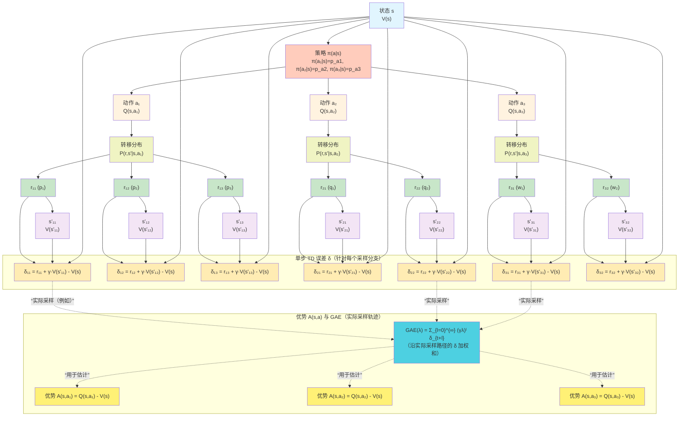

## GAE（Generalized Advantage Estimation）

### 1. 优势函数的定义

在策略 \(\pi\) 下，状态 \(s_t\) 处执行动作 \(a_t\) 的优势函数定义为：

\[
A(s_t, a_t) = Q(s_t, a_t) - V(s_t)
\]

其中：
- \(Q(s_t, a_t) = \mathbb{E}_{\pi}\left[ \sum_{k=0}^{\infty} \gamma^k r_{t+k} \,\middle|\, s_t, a_t \right]\)  
- \(V(s_t) = \mathbb{E}_{a_t \sim \pi}\left[ Q(s_t, a_t) \right]\)

---

### 2. 引入 TD 误差

单步 TD 误差定义为：

\[
\delta_t = r_t + \gamma V(s_{t+1}) - V(s_t)
\]

这个量衡量了当前状态价值估计的 **单步惊喜**。

---

### 3. 将优势表示为 TD 误差的无穷和

我们先写出 \(Q(s_t, a_t)\) 的蒙特卡洛展开。假设我们沿着一个轨迹 \(s_t, a_t, r_t, s_{t+1}, a_{t+1}, r_{t+1}, \dots\)，那么：

\[
Q(s_t, a_t) = \mathbb{E}\left[ r_t + \gamma r_{t+1} + \gamma^2 r_{t+2} + \cdots \right]
\]

为了与 \(V(s_t)\) 关联，我们将 \(V(s_{t+1})\) 反复插入：

\[
\begin{aligned}
Q(s_t, a_t) &= \mathbb{E}\Big[ r_t + \gamma V(s_{t+1}) - \gamma V(s_{t+1}) + \gamma r_{t+1} + \gamma^2 r_{t+2} + \cdots \Big] \\
&= \mathbb{E}\Big[ r_t + \gamma V(s_{t+1}) \Big] - \gamma \mathbb{E}\Big[ V(s_{t+1}) - r_{t+1} - \gamma r_{t+2} - \cdots \Big] \\
&= \big(r_t + \gamma V(s_{t+1})\big) - \gamma \big( V(s_{t+1}) - Q(s_{t+1}, a_{t+1}) \big)
\end{aligned}
\]

注意 \(V(s_{t+1}) - Q(s_{t+1}, a_{t+1}) = -A(s_{t+1}, a_{t+1})\)，所以：

\[
Q(s_t, a_t) = r_t + \gamma V(s_{t+1}) + \gamma A(s_{t+1}, a_{t+1})
\]

减去 \(V(s_t)\) 得到：

\[
A(s_t, a_t) = \big( r_t + \gamma V(s_{t+1}) - V(s_t) \big) + \gamma A(s_{t+1}, a_{t+1})
\]

即：

\[
A(s_t, a_t) = \delta_t + \gamma A(s_{t+1}, a_{t+1})
\]

这个递归关系非常重要。展开到未来 \(k\) 步：

\[
\begin{aligned}
A(s_t, a_t) &= \delta_t + \gamma \big( \delta_{t+1} + \gamma A(s_{t+2}, a_{t+2}) \big) \\
&= \delta_t + \gamma \delta_{t+1} + \gamma^2 A(s_{t+2}, a_{t+2}) \\
&= \sum_{l=0}^{k-1} \gamma^l \delta_{t+l} + \gamma^k A(s_{t+k}, a_{t+k})
\end{aligned}
\]

当 \(k \to \infty\) 且 \(\gamma^k A(\cdot) \to 0\) 时，我们得到 **无穷步优势**（即蒙特卡洛优势）：

\[
A(s_t, a_t) = \sum_{l=0}^{\infty} \gamma^l \delta_{t+l}
\]

这就是 \(\lambda = 1\) 时的 GAE。它无偏但方差高。

---

### 4. 引入 λ 进行权衡

GAE 的思想是截断上述求和，并引入衰减因子 \(\lambda \in [0,1]\) 来平衡偏差与方差：

\[
A_t^{\text{GAE}(\gamma,\lambda)} = \sum_{l=0}^{\infty} (\gamma\lambda)^l \delta_{t+l}
\]

- 当 \(\lambda = 0\)：\(A_t^{\text{GAE}} = \delta_t\)（仅用一步 TD 误差，低方差，高偏差）
- 当 \(\lambda = 1\)：\(A_t^{\text{GAE}} = \sum_{l=0}^{\infty} \gamma^l \delta_{t+l}\)（蒙特卡洛优势，无偏，高方差）

中间值（如 \(\lambda = 0.95\)）获得折衷。

---

### 5. 递推计算公式（高效实现）

直接按定义求和计算量大，通常采用从后向前的递推。定义：

\[
\mathcal{A}_t = \sum_{l=0}^{\infty} (\gamma\lambda)^l \delta_{t+l}
\]

则：

\[
\mathcal{A}_t = \delta_t + \gamma\lambda \cdot \mathcal{A}_{t+1}
\]

这正好对应代码中的反向循环：

```python
last_gae = 0.0
for t in reversed(range(T)):
    delta = r_t + gamma * V(s_{t+1}) * (1-done_t) - V(s_t)
    last_gae = delta + gamma * lam * (1-done_t) * last_gae
    adv[t] = last_gae
```

其中 `(1-done_t)` 处理终止状态（此时下一状态价值为 0，且未来 GAE 清零）。

---

### 6. GAE 的另一种理解：指数加权平均

定义 \( k \) 步优势估计：
\[
A_t^{(k)} = \sum_{l=0}^{k-1} \gamma^l \delta_{t+l} = G_t^{(k)} - V(s_t)
\]
其中 \( G_t^{(k)} \) 是 \( k \) 步回报。可以证明：
\[
A_t^{\text{GAE}} = (1-\lambda) \sum_{k=1}^\infty \lambda^{k-1} A_t^{(k)}
\]
即 GAE 是不同步数优势估计的指数加权平均，\( \lambda \) 控制衰减速度。


### 7. 为什么 GAE 是广义的？

GAE 统一了不同步数的优势估计：

\[
A_t^{\text{GAE}} = \delta_t + \gamma\lambda \delta_{t+1} + (\gamma\lambda)^2 \delta_{t+2} + \cdots
\]

如果我们将 \(\delta_t\) 的表达式代入，会发现它等价于：

\[
A_t^{\text{GAE}} = (1-\lambda) \sum_{k=0}^{\infty} \lambda^k A_t^{(k)}
\]

其中 \(A_t^{(k)} = \sum_{l=0}^{k} \gamma^l \delta_{t+l}\) 是 **k 步优势估计**。因此 GAE 是指数加权平均不同步数的优势估计，\(\lambda\) 控制衰减速度。

---

### 总结

| 步骤 | 内容 |
|------|------|
| 1 | 优势定义 \(A = Q - V\) |
| 2 | TD 误差 \(\delta_t = r_t + \gamma V(s_{t+1}) - V(s_t)\) |
| 3 | 推导递归关系 \(A_t = \delta_t + \gamma A_{t+1}\) |
| 4 | 展开得 \(A_t = \sum_{l=0}^{\infty} \gamma^l \delta_{t+l}\)（λ=1 情况） |
| 5 | 引入 λ 得到 GAE：\(A_t^{\text{GAE}} = \sum_{l=0}^{\infty} (\gamma\lambda)^l \delta_{t+l}\) |
| 6 | 递推式 \(A_t^{\text{GAE}} = \delta_t + \gamma\lambda A_{t+1}^{\text{GAE}}\) 用于高效计算 |

GAE 是现代策略梯度算法（如 PPO、A2C）中估计优势的标准方法，因其能有效控制方差且计算简单。


---

## GAE（λ = 1 特例）:蒙特卡洛优势函数


### 1.蒙特卡洛优势的递归展开

蒙特卡洛回报 \( G_t = \sum_{k=0}^\infty \gamma^k r_{t+k} \) 满足：
\[
G_t = r_t + \gamma G_{t+1}
\]
因此：
\[
\begin{aligned}
A_t^{\text{MC}} &= G_t - V(s_t) \\
&= r_t + \gamma G_{t+1} - V(s_t) \\
&= \underbrace{(r_t + \gamma V(s_{t+1}) - V(s_t))}_{\delta_t} + \gamma (G_{t+1} - V(s_{t+1})) \\
&= \delta_t + \gamma A_{t+1}^{\text{MC}}
\end{aligned}
\]
递归展开 \( A_{t+1}^{\text{MC}} \) 得到：
\[
A_t^{\text{MC}} = \delta_t + \gamma \delta_{t+1} + \gamma^2 \delta_{t+2} + \cdots = \sum_{l=0}^\infty \gamma^l \delta_{t+l}
\]
（假设 \( \lim_{k\to\infty} \gamma^k A_{t+k}=0 \)）

**特点**：
- 直接计算每个时间步的 **折扣累计回报** \(G_t\)（蒙特卡洛回报），然后减去 \(V(s_t)\) 得到优势。
- 等价于 GAE 中 \(\lambda = 1\) 且无限步数（或直到 episode 结束）的情况。
- 需要两个遍历：先逐 episode 计算 \(G_t\)（反向累积），再与 \(V(s_t)\) 相减。
- **没有使用 TD 误差**，也没有 \(\lambda\) 参数。
- 方差较高（因为 \(G_t\) 包含所有未来奖励的随机性），但理论上是无偏的优势估计。


| 对比维度 | GAE | 蒙特卡洛adv |
|---------|---------------|------------------------|
| **公式** | \(A_t^{\text{GAE}} = \sum_{l=0}^{\infty} (\gamma\lambda)^l \delta_{t+l}\) | \( A_t^{\text{MC}} = G_t - V(s_t) = \sum_{l=0}^\infty \gamma^l \delta_{t+l} \) |
| **λ 参数** | 可调（常用 0.95） | 固定 λ = 1 |
| **偏差** | λ<1 时有偏差 | 无偏 |
| **方差** | λ<1 时方差较小 | 高方差 |
| **计算依赖** | 需要下一状态价值 \(V(s_{t+1})\) 和 done 标志 | 仅需要本 episode 内的奖励序列 |
| **终止处理** | 通过 `next_non_terminal` 显式处理 | 通过 episode 边界自然处理（累积不跨 episode） |
| **算法用途** | PPO、A2C 等主流算法 | 较老的策略梯度（如 REINFORCE with baseline） |
| **计算效率** | 一次反向遍历 | 两次遍历（计算 \(G_t\) + 减法） |

---

### 2.何时用哪种

- **优先使用 GAE**（第一段）：  
  现代深度强化学习（PPO、A2C、TRPO）几乎都采用 GAE，因为它能通过调节 \(\lambda\) 有效降低方差，同时保持可接受的偏差，训练更稳定。

- **使用蒙特卡洛优势（第二段）**：  
  仅在以下情况可能考虑：
  - 环境 episode 很短，方差不是主要问题。
  - 你需要完全无偏的优势估计（例如某些理论分析）。
  - 你实现的是简单的 REINFORCE with baseline，且不想引入 GAE 的复杂性。


从蒙特卡洛优势 \( A_t^{\text{MC}} = G_t - V(s_t) \) 到 GAE 形式 \( A_t^{\text{GAE}} = \sum_{l=0}^\infty (\gamma\lambda)^l \delta_{t+l} \) 的转换，本质是通过 **引入 TD 误差的指数衰减加权** 来降低方差。下面是详细的推导步骤：

---

## GAE（λ = 0 特例）:TD优势
当 \(\lambda = 0\) 时，GAE 的无穷级数退化为仅第一项：

\[
A_t^{\text{GAE}(\gamma,0)} = \sum_{l=0}^{\infty} (\gamma \cdot 0)^l \delta_{t+l}
\]

因为 \(0^0 = 1\)，而对于 \(l \ge 1\)，\(0^l = 0\)，所以：

\[
A_t^{\text{GAE}(\gamma,0)} = 1 \cdot \delta_t + 0 \cdot \delta_{t+1} + 0 \cdot \delta_{t+2} + \cdots = \delta_t
\]

其中 \(\delta_t = r_t + \gamma V(s_{t+1}) - V(s_t)\) 是单步 TD 误差。

**解释**：
- \(\lambda = 0\) 表示完全不考虑未来多步的 TD 误差，只使用当前步的即时信息。
- 此时优势估计的方差最小（因为只依赖一个随机变量），但偏差最大（因为忽略了未来奖励的影响，相当于用一步回报 \(r_t + \gamma V(s_{t+1})\) 近似 \(Q(s_t,a_t)\)）。
- 这种估计等价于 **“一步优势”** 或 **“TD 优势”**，在实践（如 PPO）中很少直接使用，因为偏差会导致策略更新偏向短视行为。